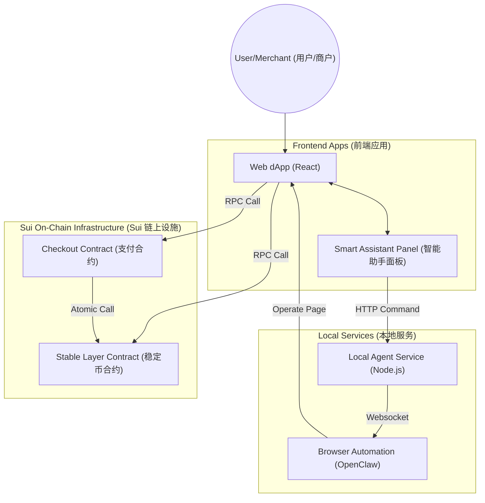
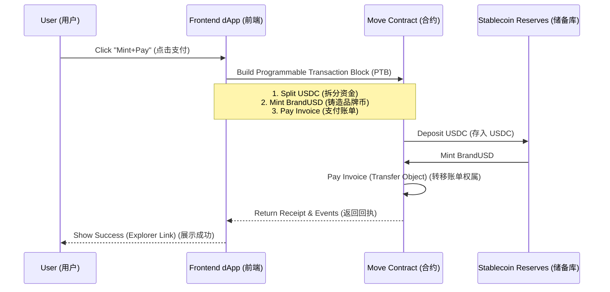

# Stableflow Checkout Professional Demo Script (Bi-Lingual / 中英文对照版)

> **Demo Duration**: 3-5 Minutes
> **演示时长**: 3-5 分钟
>
> **Core Narrative**: Solving the fragmentation of stablecoin payments via atomic orchestration (Mint+Pay) using Move contracts, and enabling secure automated interactions via Local Agent.
> **核心叙事**: 通过 Move 合约的原子编排 (Mint+Pay) 解决稳定币支付碎片化问题，并利用 Local Agent 实现安全的自动化交互。

---

## Part 0: Seven Core Interfaces Overview (七大核心界面功能全解)

This project consists of 7 key pages that form a complete commercial loop.
本项目由 7 个核心页面组成，构成了一个完整的商业闭环。

### 1. Quickstart (引导体验)
- **Route**: `/quickstart`
- **Role**: Experience Guide & Status Check (体验向导与状态检查)
- **Functions (功能)**:
    - **Interactive Guide (交互式引导)**: Step-by-step navigation for "Create Invoice -> Pay -> Redeem -> Claim". (分步引导“建单->支付->赎回->领收益”全流程)
    - **Chain Health (链上健康度)**: Real-time check of RPC connection, Gas balance, and environment config. (实时检查 RPC 连接、Gas 余额及环境配置)
    - **Demo Reset (演示重置)**: One-click cleanup of local state to restart the demo. (一键重置本地状态，重新开始演示)

### 2. Merchant Dashboard (商户台)
- **Route**: `/merchant`
- **Role**: Product & Invoice Management (商品与账单管理)
- **Functions (功能)**:
    - **Product Mgmt (商品管理)**: Create on-chain product objects (SKUs) with price and title. (创建链上商品对象，定义价格与标题)
    - **Invoice Mgmt (账单管理)**: Issue "Shared Object" invoices based on products. (基于商品开具“共享对象”形式的账单)
    - **Payment Routing (支付路由)**: Direct access to the payment page for any invoice. (直接跳转至任意账单的支付页)

### 3. Payment Page (支付收银台)
- **Route**: `/pay/:invoiceId` (Linked via Merchant or Quickstart)
- **Role**: Atomic Payment Executer (原子支付执行器)
- **Functions (功能)**:
    - **Atomic Mint+Pay (原子一键支付)**: Combine "Stake USDC -> Mint BrandUSD -> Pay Invoice" into **ONE** transaction. (将“质押 USDC -> 铸造品牌币 -> 支付账单”合并为**一笔**交易)
    - **Status Feedback (状态反馈)**: Real-time display of Transaction Digest and Explorer Link. (实时展示交易哈希与浏览器链接)

### 4. Merchant Claim (领取收益)
- **Route**: `/merchant/claim`
- **Role**: Revenue Settlement (结算中心)
- **Functions (功能)**:
    - **Yield Claim (收益提取)**: Merchants withdraw the BrandUSD revenue accumulated in the contract to their wallet. (商户将合约中累积的 BrandUSD 营收提取至钱包)
    - **Permission Control (权限控制)**: Only the merchant capability holder can execute claims. (仅商户权限持有者可执行提取)

### 5. Redemption Center (赎回中心)
- **Route**: `/redeem`
- **Role**: User Redemption (用户赎回)
- **Functions (功能)**:
    - **Burn Mechanism (销毁机制)**: Users burn BrandUSD to redeem underlying USDC 1:1. (用户销毁 BrandUSD 以 1:1 赎回底层 USDC)
    - **Flexible Amount (灵活金额)**: Supports "Redeem Amount" (Partial) or "Redeem All" (Full). (支持按金额部分赎回或一键全部赎回)

### 6. Merchant Metrics (指标看板)
- **Route**: `/merchant/metrics`
- **Role**: Business Intelligence (数据可视化)
- **Functions (功能)**:
    - **On-Chain Data (链上数据)**: Real-time protocol TVL (Total Value Locked), Total Supply, and Reserves. (实时协议 TVL、总供应量与储备金)
    - **Business Stats (业务统计)**: GMV (Gross Merchandise Value) and Payment Conversion Rates. (GMV 与支付转化率统计)

### 7. Local Automation (本地自治)
- **Route**: `/automation`
- **Role**: Task Orchestration Console (本地任务编排台)
- **Functions (功能)**:
    - **Natural Language Orchestration (自然语言编排)**: Input goals (e.g., "Organize files") -> Generate Execution Plan. (输入目标 -> 生成执行计划)
    - **Risk Guard (风险守卫)**: Analyze high-risk commands before execution. (执行前分析高危命令)
    - **Audit Logs (审计日志)**: Export execution history to Markdown security reports. (导出执行历史为 Markdown 安全报告)

*(Bonus: **Local Agent Debugger** at `/agent` for configuring LLM and monitoring logs)*
*(附赠: `/agent` 页面用于配置 LLM 及监控 Agent 原始日志)*

---

## Part 0.5: Detailed Interface Elements (界面元素详解)

Here is a detailed breakdown of every button and input field for your 3-minute walk-through.
以下是为您准备的 3 分钟演示中，每个界面按钮和输入框的详细中英文对照说明。

### 1. Quickstart Page (`/quickstart`)
*   **Hero Section (主标题区)**
    *   `Title`: "Stableflow Checkout System" (Stableflow 支付收银系统)
    *   `Button` **"Start Demo / 开始演示"**: Resets local state and clears old data to ensure a fresh demo environment. (重置本地状态，清除旧数据，确保演示环境干净)
*   **Step Cards (步骤卡片)**
    *   `Card 1` **"Merchant Setup"**:
        *   `Button` **"Go to Merchant / 前往商户台"**: Navigates to the Merchant Dashboard. (跳转至商户后台)
    *   `Card 2` **"User Payment"**:
        *   `Button` **"Go to Pay / 前往支付页"**: Navigates to a sample payment page (requires an Invoice ID). (跳转至支付演示页，通常需要账单ID)
    *   `Card 3` **"Redeem"**:
        *   `Button` **"Go to Redeem / 前往赎回"**: Navigates to the User Redemption page. (跳转至用户赎回页)
    *   `Card 4` **"Merchant Claim"**:
        *   `Button` **"Go to Claim / 前往提现"**: Navigates to the Merchant Settlement page. (跳转至商户结算页)

### 2. Merchant Dashboard (`/merchant`)
*   **Header (顶部导航)**
    *   `Logo`: "Stableflow" -> Returns to Home. (返回首页)
    *   `Button` **"Connect Wallet / 连接钱包"**: Connects your Sui wallet (e.g., Suiet, Sui Wallet). (连接 Sui 钱包)
*   **Create Product Panel (创建商品面板)**
    *   `Input` **"Product Title / 商品名称"**: Enter product name, e.g., "Hackathon T-Shirt". (输入商品名称)
    *   `Input` **"Price (USD) / 价格"**: Enter price in USD, e.g., "10". (输入价格)
    *   `Button` **"Create Product / 创建商品"**: Calls smart contract to create a Product Object on-chain. (调用合约在链上创建商品对象)
*   **Product List (商品列表)**
    *   `List Item`: Shows Product ID, Title, Price. (显示商品 ID、名称、价格)
    *   `Button` **"Create Invoice / 创建账单"**: Generates a payment invoice for this specific product. (为该商品生成支付账单)
*   **Invoice List (账单列表)**
    *   `List Item`: Shows Invoice ID, Status (Unpaid/Paid). (显示账单 ID、状态)
    *   `Button` **"Copy Link / 复制链接"**: Copies the payment link to clipboard. (复制支付链接)
    *   `Button` **"Pay / 支付"**: Navigates to the payment page for this invoice. (跳转至该账单的支付页)

### 3. Payment Page (`/pay/:id`)
*   **Invoice Details (账单详情)**
    *   `Text`: Displays "Pay to [Merchant]", "Amount", "Product Name". (显示“支付给[商户]”、“金额”、“商品名”)
    *   `Status Badge`: "UNPAID" (Yellow) or "PAID" (Green). (未支付/已支付状态标签)
*   **Payment Methods (支付方式)**
    *   `Radio Button` **"USDC (Mint+Pay)"**: Selects the atomic Mint+Pay method using USDC. (选择 USDC 原子化铸造并支付)
    *   `Radio Button` **"BrandUSD"**: Selects direct payment using existing brand stablecoins. (选择使用现有品牌币直接支付)
*   **Action Area (操作区)**
    *   `Button` **"Pay [Amount] USDC"**: Triggers the wallet signature for the atomic transaction. (触发原子交易的钱包签名)
    *   `Text` **"Fee Breakdown / 费用明细"**: Shows network gas fee and conversion rate (1:1). (显示网络 Gas 费及 1:1 汇率)

### 4. Agent Drawer / Chat (`Floating Button`)
*   **Floating Button (悬浮球)**
    *   `Icon`: "🤖" (Bottom Right/右下角) -> Toggles the Assistant Panel. (开关助手面板)
*   **Chat Panel (聊天面板)**
    *   `Header`: **"Stableflow Assistant"** with `Status` (Online/Offline). (助手标题及在线状态)
    *   `Tabs` **"Config / 配置"**:
        *   `Input` **"LLM API Key"**: Enter OpenAI/Anthropic Key here to enable AI features. (输入 Key 以开启 AI 功能)
        *   `Input` **"Endpoint"**: Default `http://localhost:3777`. (默认本地服务地址)
        *   `Toggle` **"Enable LLM / 开启大模型"**: Switches between Rules-based and LLM-based parsing. (切换规则/大模型解析)
    *   `Message Area`: Shows chat history. (显示聊天记录)
    *   `Input Bar`: **"Type a command... / 输入指令..."**:
        *   Example: "Redeem all my BrandUSD" (把我的 BrandUSD 全部赎回)
        *   Example: "Check status of tx..." (查询交易状态...)
    *   `Button` **"Send / 发送"**: Sends message to Local Agent. (发送消息给本地 Agent)

### 5. Redemption Page (`/redeem`)
*   **Balance Display (余额展示)**
    *   `Card`: "Your BrandUSD Balance". (您的 BrandUSD 余额)
*   **Redeem Form (赎回表单)**
    *   `Input` **"Amount / 金额"**: Amount to burn/redeem. (赎回数量)
    *   `Button` **"Max / 全部"**: Fills in total available balance. (填入全部余额)
    *   `Button` **"Redeem to USDC / 赎回为 USDC"**: Executes burn transaction to get USDC back. (执行销毁交易以取回 USDC)

### 6. Merchant Metrics (`/merchant/metrics`)
*   **Dashboard Cards (看板卡片)**
    *   `Card` **"TVL"**: Total Value Locked in protocol. (协议总锁仓量)
    *   `Card` **"Total Supply"**: Total circulated BrandUSD. (BrandUSD 总流通量)
    *   `Card` **"Revenue"**: Unclaimed merchant revenue. (商户未提取营收)
*   **Charts (图表)**
    *   (If available) Simple bar/line charts showing daily volume. (简单的日交易量图表)

---

## Part 1: The Hook (30 seconds / 开场 30秒)

**Script (话术)**:

"Hello everyone, I am the developer of Stableflow Checkout. In Web3 payments, merchants and users often face a pain point: **Payment Fragmentation**. Users hold USDC, but merchants require branded stablecoins (BrandUSD); or users need to Swap before Pay, which is cumbersome and incurs high Gas fees.
“大家好，我是 Stableflow Checkout 的开发者。在 Web3 支付中，商户和用户常面临一个痛点：**支付碎片化**。用户持有 USDC，但商户要求品牌稳定币 (BrandUSD)；或者用户需要先 Swap 再 Pay，操作繁琐且 Gas 费高。

Today I will demonstrate **Stableflow Checkout**, which enables 'One-Click Mint+Pay' atomic transactions via Move smart contracts, combined with a locally running **Local Agent** to achieve full-process automation from invoicing to settlement."
今天我将演示 **Stableflow Checkout**，它利用 Move 智能合约实现‘一键 Mint+Pay’原子交易，并结合本地运行的 **Local Agent** 实现从开票到结算的全流程自动化。”

---

## Part 2: Architecture Overview (架构概览)

**Action**: Open `README.md` or show this architecture diagram.
**动作**: 打开 `README.md` 或展示架构图。

**Explanation (解说)**:

"The system consists of three parts:
系统由三部分组成：
1.  **User Interface**: A modern React-based dApp integrated with a frosted-glass style Agent Panel. (用户界面：基于 React 的现代化 dApp，集成毛玻璃风格 Agent 面板)
2.  **Local Agent**: A Node.js service running locally, responsible for executing automation playbooks. It **does not handle private keys** and only assists with operations. (本地 Agent：运行在本地的 Node.js 服务，负责执行自动化剧本。它**不接触私钥**，仅辅助操作)
3.  **On-Chain Contracts**: Core Move contracts responsible for handling the atomic logic of Mint+Pay. (链上合约：负责处理 Mint+Pay 原子逻辑的核心 Move 合约)"

---

## Part 3: Core Demo Flow (核心演示流程)

### Phase 1: Merchant Setup (商户设置)

**Steps (步骤)**:
1.  Go to `/merchant` page. (前往商户台)
2.  Click **"Connect Wallet"**. (连接钱包)
3.  Create a product (e.g., "2024 Hackathon T-Shirt", Price 10 BrandUSD). (创建商品，例如“2024 黑客松 T恤”，价格 10 BrandUSD)
4.  Click **"Create Invoice"** based on the product. (基于商品创建账单)

**Script (话术)**:
"First, as a merchant, I create a payment invoice on-chain. Note that every invoice is a real Object on Sui, which means it is tamper-proof and traceable."
“首先，作为商户，我在链上创建一个支付账单。请注意，每个账单都是 Sui 上真实的 Object，这意味着它防篡改且可追溯。”

---

### Phase 2: User Atomic Payment (用户原子支付 Mint+Pay)

**Steps (步骤)**:
1.  Click the newly created Invoice in the list to enter `/pay/:invoiceId`. (点击列表中的新账单进入支付页)
2.  **Focus**: Show the "Recommended Payment Method" area. (聚焦：展示“推荐支付方式”区域)
3.  Click **"USDC One-Click Pay (Mint+Pay)"**. (点击“USDC 一键支付”)
4.  Wallet signature confirmation. (钱包签名确认)

**Script (话术)**:
"This is the core magic. The user only holds USDC, but the merchant requires BrandUSD. Traditional models require users to trade on a DEX and then come back to pay.
In Stableflow, we package 'Collateralize USDC to Mint BrandUSD' and 'Pay Invoice' into a single atomic transaction. One click, instant completion."
“这就是核心魔法所在。用户只持有 USDC，但商户要求 BrandUSD。传统模式需要用户去 DEX 交易后再回来支付。
在 Stableflow 中，我们将‘抵押 USDC 铸造 BrandUSD’和‘支付账单’打包成一个原子交易。一键点击，瞬间完成。”

---

### Phase 3: Agent Automation & Settlement (Agent 自动化与结算)

**Steps (步骤)**:
1.  Click the **"Smart Assistant"** floating button (bottom right). (点击右下角“智能助手”悬浮球)
2.  Input: "Please help me redeem all the money I just earned back to USDC." (输入：“请帮我把刚赚的钱全部赎回成 USDC。”)
3.  Agent parses intent and suggests: **"Recommended Action: Redeem All (Burn All)"**. (Agent 解析意图并建议：“推荐动作：全部赎回”)
4.  User clicks execute, signs transaction. (用户点击执行，签名)
5.  Finally, go to `/merchant/metrics` to view the dashboard. (最后，前往指标页查看看板)

**Script (话术)**:
"After the transaction, the merchant may want to repatriate funds. With Local Agent, no need to hunt for buttons in menus—just tell the assistant your intent.
The Agent not only chats but constructs complex on-chain transactions. Look, funds are redeemed, and we can see the real-time changes in the **Stablecoin Reserves** on the Dashboard, completely transparent."
“交易完成后，商户可能希望回笼资金。有了 Local Agent，无需在菜单中寻找按钮——只需告诉助手你的意图。
Agent 不仅会聊天，还能构建复杂的链上交易。看，资金已赎回，我们可以在看板上看到 **稳定币储备** 的实时变化，完全透明。”

---

## Part 4: Closing (结语)

**Script (话术)**:
"Stableflow Checkout demonstrates the high performance and flexibility of the Sui network.
Stableflow Checkout 展示了 Sui 网络的高性能与灵活性。

1.  **Experience Upgrade (体验升级)**: Atomic Mint+Pay via Move PTB, seamless currency conversion for users. (通过 Move PTB 实现原子化 Mint+Pay，用户无感换汇)
2.  **Interaction Innovation (交互创新)**: Introducing Local Agent to naturalize complex on-chain operations. (引入 Local Agent，使复杂的链上操作自然化)
3.  **Secure & Transparent (安全透明)**: Full on-chain traceability, Local Agent strictly adheres to non-custodial principles. (全链上可追溯，Local Agent 严格遵守非托管原则)

This is the new paradigm we bring to Web3 payments. Thank you!
这就是我们为 Web3 支付带来的新范式。谢谢！"

---

## Appendix: Demo Fallback Plan (附录：演示备选方案)

*   **Network Lag**: Switch to URL parameter `?smoke=1` to enter **Smoke Mode**. (网络卡顿：切换 URL 参数 `?smoke=1` 进入 **Smoke 模式**)
*   **Agent Disconnected**: Manually click buttons to complete operations. (Agent 断连：手动点击按钮完成操作)
