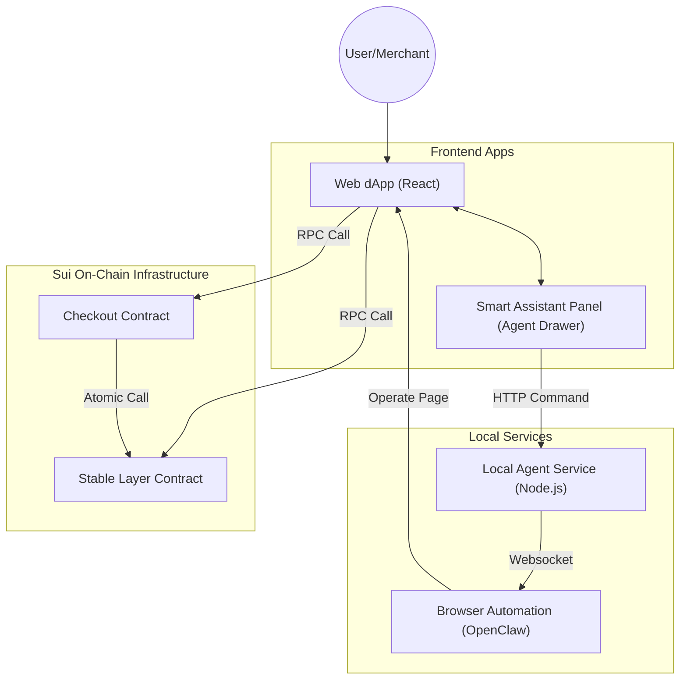
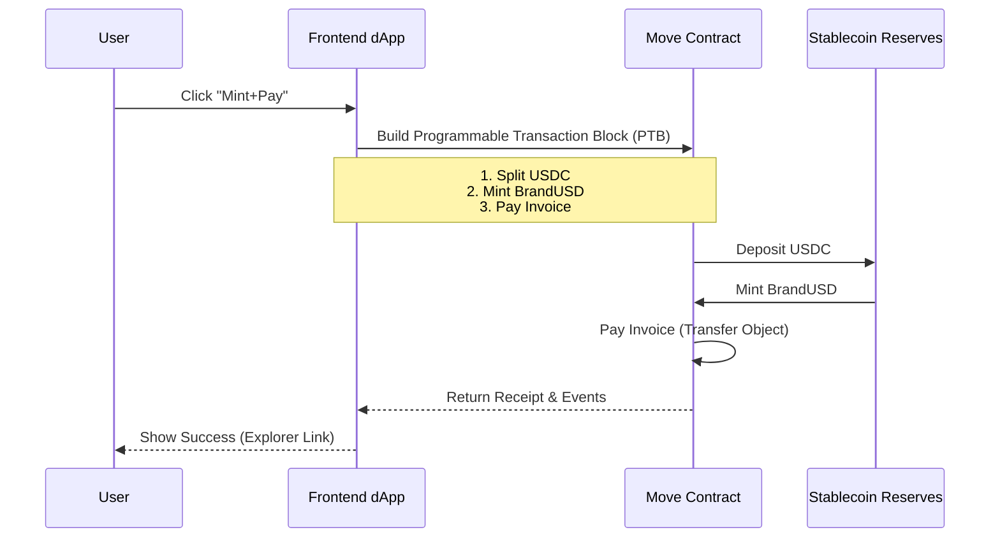

# Stableflow Checkout Professional Demo Script

> **Demo Duration**: 3-5 Minutes
> **Core Narrative**: Solving the fragmentation of stablecoin payments via atomic orchestration (Mint+Pay) using Move contracts, and enabling secure automated interactions via Local Agent.

## 1. The Hook (30 seconds)

**Script**:
"Hello everyone, I am the developer of Stableflow Checkout. In Web3 payments, merchants and users often face a pain point: **Payment Fragmentation**. Users hold USDC, but merchants require branded stablecoins (BrandUSD); or users need to Swap before Pay, which is cumbersome and incurs high Gas fees.

Today I will demonstrate **Stableflow Checkout**, which enables 'One-Click Mint+Pay' atomic transactions via Move smart contracts, combined with a locally running **Local Agent** to achieve full-process automation from invoicing to settlement."

---

## 2. Architecture Overview

**Action**: Open `README.md` or show this architecture diagram.

**Explanation**:
"The system consists of three parts:
1.  **User Interface**: A modern React-based dApp integrated with a frosted-glass style Agent Panel.
2.  **Local Agent**: A Node.js service running locally, responsible for executing automation playbooks. It **does not handle private keys** and only assists with operations.
3.  **On-Chain Contracts**: Core Move contracts responsible for handling the atomic logic of Mint+Pay."

---

## 3. Core Demo Flow

### Phase 1: Merchant Setup

**Steps**:
1.  Go to `/merchant` page.
2.  Click **"Connect Wallet"**.
3.  Create a product (e.g., "2024 Hackathon T-Shirt", Price 10 BrandUSD).
4.  Click **"Create Invoice"** based on the product.

**Deep Dive**:
*   **Product Management**: Simulates an e-commerce backend, managing SKUs via object models.
*   **Invoice Generator**: Each invoice creation generates a unique on-chain object (Shared Object) containing metadata like amount, payee, and expiration, ensuring transparency and traceability.

**Script**:
"First, as a merchant, I create a payment invoice on-chain. Note that every invoice is a real Object on Sui, which means it is tamper-proof and traceable."

---

### Phase 2: User Atomic Payment (Atomic Mint+Pay)

**Steps**:
1.  Click the newly created Invoice in the list to enter `/pay/:invoiceId`.
2.  **Focus**: Show the "Recommended Payment Method" area.
3.  Click **"USDC One-Click Pay (Mint+Pay)"**.
4.  Wallet signature confirmation.

**Deep Dive**:
*   **Smart Routing**: Frontend automatically calculates user USDC balance and estimates BrandUSD needed.
*   **Atomic Assurance**: Using Sui's Programmable Transaction Block (PTB), if payment fails, the preceding Mint operation automatically rolls back. **Zero risk to user funds**.

**Script**:
"This is the core magic. The user only holds USDC, but the merchant requires BrandUSD. Traditional models require users to trade on a DEX and then come back to pay.
In Stableflow, we package 'Collateralize USDC to Mint BrandUSD' and 'Pay Invoice' into a single atomic transaction. One click, instant completion."

---

### Phase 3: Agent Automation & Settlement

**Steps**:
1.  Click the **"Smart Assistant"** floating button (bottom right).
2.  Input: "Please help me redeem all the money I just earned back to USDC."
3.  Agent parses intent and suggests: **"Recommended Action: Redeem All (Burn All)"**.
4.  User clicks execute, signs transaction.
5.  Finally, go to `/merchant/metrics` to view the dashboard.

**Deep Dive**:
*   **Agent Drawer**: Integrated with LLM parsing (optional) and rule engine. It comprehends natural language and converts it into specific contract parameters (e.g., constructing `Burn` transaction).
*   **Guardrails**: Notice that the Agent **only offers suggestions**. Final transaction signatures must be manually confirmed by the user. The Agent cannot misappropriate funds.
*   **Metrics Dashboard**: Fetches `TotalSupply` and `Reserve Balance` from chain in real-time for transparent auditing.

**Script**:
"After the transaction, the merchant may want to repatriate funds. With Local Agent, no need to hunt for buttons in menus—just tell the assistant your intent.
The Agent not only chats but constructs complex on-chain transactions. Look, funds are redeemed, and we can see the real-time changes in the **Stablecoin Reserves** on the Dashboard, completely transparent."

---

## 4. Closing

**Script**:
"Stableflow Checkout demonstrates the high performance and flexibility of the Sui network.
1.  **Experience Upgrade**: Atomic Mint+Pay via Move PTB, seamless currency conversion for users.
2.  **Interaction Innovation**: Introducing Local Agent to naturalize complex on-chain operations.
3.  **Secure & Transparent**: Full on-chain traceability, Local Agent strictly adheres to non-custodial principles.

This is the new paradigm we bring to Web3 payments. Thank you!"

---

## Appendix: Demo Fallback Plan

*   **Network Lag**: Switch to URL parameter `?smoke=1` to enter **Smoke Mode**, simulating on-chain interaction for a smooth flow.
*   **Agent Disconnected**: `Agent Drawer` will alert "Service Offline". Since the dApp is fully functional, you can manually click buttons to complete all operations (Emphasize: Agent is an enhancement, not a dependency).
